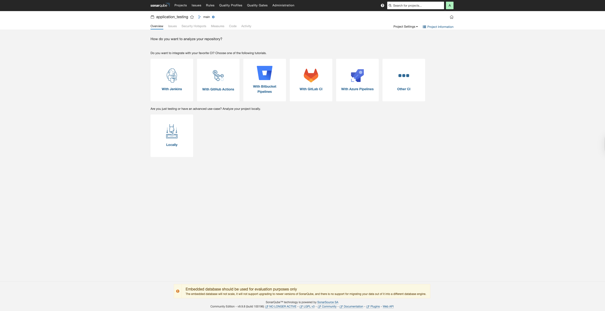
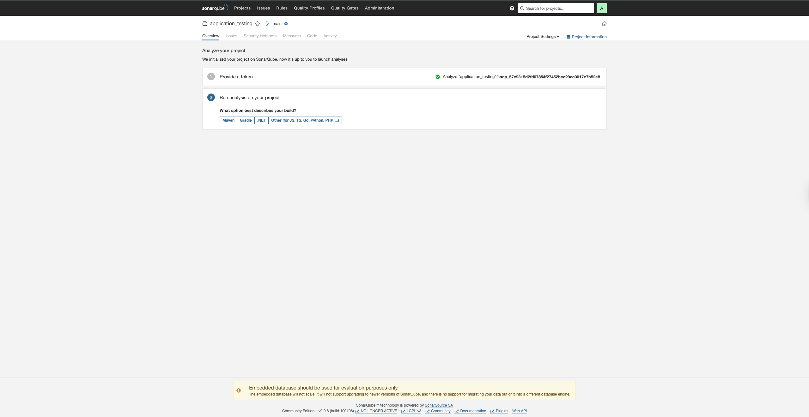
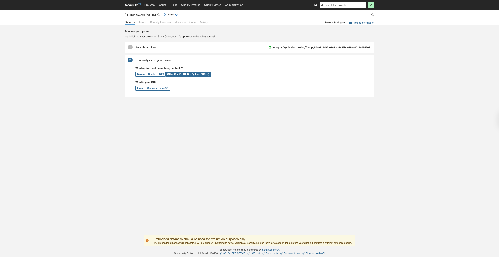
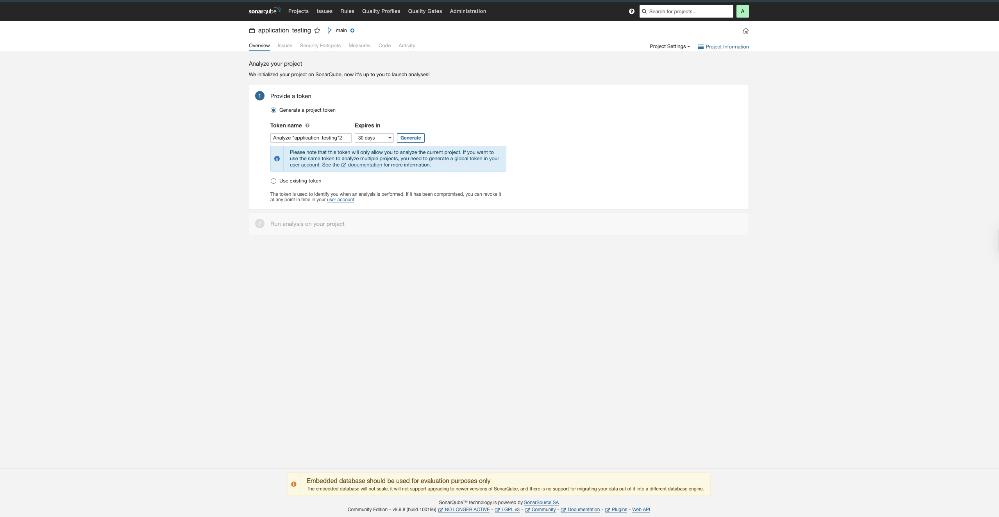
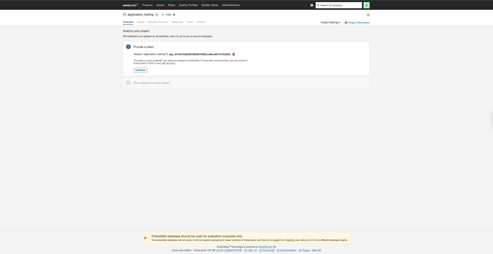
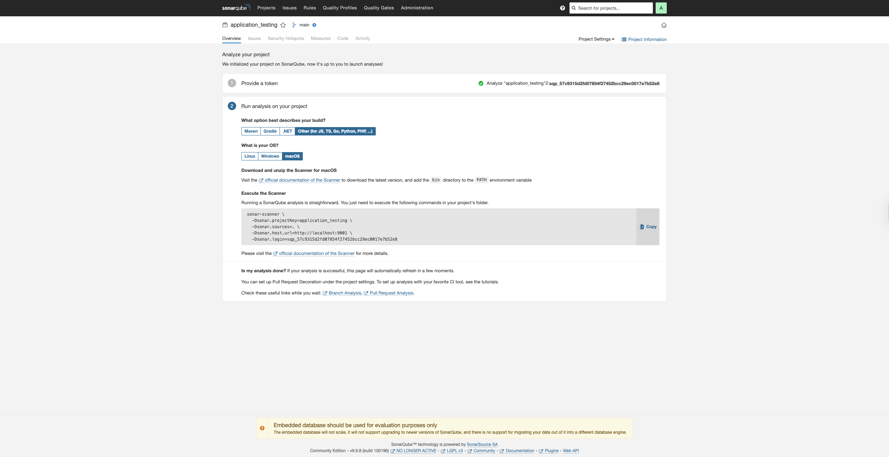

# APDS Secure Portal - Complete Setup Guide

## Prerequisites

### 1. Install Node.js (v18 or higher)
- Download from: https://nodejs.org/
- Install and verify:
```cmd
node --version
npm --version
```

### 2. Install Git
- Download from: https://git-scm.com/download/win
- Verify installation:
```cmd
git --version
```

### 3. Install Docker Desktop for Windows
- Download from: https://www.docker.com/products/docker-desktop/
- Install and start Docker Desktop
- Verify installation:
```cmd
docker --version
docker-compose --version
```

## Step 1: Clone the Repository

1. Open Command Prompt or PowerShell
2. Navigate to your desired directory:
```cmd
cd C:\Users\YourUsername\Documents
```
3. Clone the repository:
```cmd
git clone https://github.com/yourusername/apds7311-secure-portal-main.git
cd apds7311-secure-portal-main
```

## Step 2: Environment Configuration

### Server Environment (.env)

1. Navigate to the server directory:
```cmd
cd server
```

2. Copy the example file:
```cmd
copy env.example .env
```

3. Open `server\.env` in a text editor (Notepad, VS Code, etc.) and configure:

```env
NODE_ENV=development
PORT=8443
ALLOWED_ORIGIN=http://localhost:3000

# JWT Secret - Generate a random string (at least 32 characters)
JWT_SECRET=your-super-secret-jwt-key-change-this-in-production

# Data Encryption Key - Must be exactly 64 hex characters (32 bytes)
# Generate one using: node -e "console.log(require('crypto').randomBytes(32).toString('hex'))"
DATA_KEY_HEX=0000000000000000000000000000000000000000000000000000000000000000

# Database Configuration
DB_HOST=127.0.0.1
DB_PORT=3307
DB_USER=root
DB_PASS=rootpass
DB_NAME=apds_app

# Employee Seeding (for initial employee user)
SEED_EMP_EMAIL=employee1@bank.local
SEED_EMP_PASSWORD=ChangeMe!123

# HTTP Dev Server (to avoid self-signed cert warnings)
ENABLE_HTTP_DEV=true
HTTP_PORT=8084
```

**Important:** Generate a secure `DATA_KEY_HEX`:
```cmd
node -e "console.log(require('crypto').randomBytes(32).toString('hex'))"
```
Copy the output and paste it into `DATA_KEY_HEX` in `server\.env`.

### Client Environment (.env)

1. Navigate to the client directory:
```cmd
cd ..\client
```

2. Copy the example file:
```cmd
copy env.example .env
```

3. Open `client\.env` and set:
```env
REACT_APP_API_URL=http://localhost:8084/api
```

## Step 3: Start Docker Desktop

1. Launch Docker Desktop from the Start menu
2. Wait until Docker Desktop shows "Docker Desktop is running" in the system tray
3. Verify Docker is running:
```cmd
docker ps
```

## Step 4: Start Docker Services (MySQL & SonarQube)

From the project root directory:

```cmd
docker-compose up -d db sonarqube
```

This starts:
- MySQL on port 3307 (host) → 3306 (container)
- SonarQube on port 9001 (host) → 9000 (container)

Wait 30-60 seconds for services to initialize.

## Step 5: Install Dependencies

### Server Dependencies

```cmd
cd server
npm install
```

### Client Dependencies

```cmd
cd ..\client
npm install
```

## Step 6: Initialize Database

From the `server` directory:

```cmd
npm run db:schema
npm run seed:roles
npm run seed:employees
```

This creates the database schema and seeds initial roles and an employee user.

## Step 7: Start the Application

### Option A: One-Command Startup (if start-all.sh works on Windows with Git Bash)

1. Open Git Bash (installed with Git)
2. Navigate to project root
3. Make script executable:
```bash
chmod +x start-all.sh
./start-all.sh
```

### Option B: Manual Startup (Recommended for Windows)

**Terminal 1 - Start Server:**
```cmd
cd server
npm run dev
```

**Terminal 2 - Start Client:**
```cmd
cd client
npm start
```

The application will be available at:
- **Client UI:** http://localhost:3000
- **API (HTTPS):** https://localhost:8443
- **API (HTTP Dev):** http://localhost:8084

## Step 8: SonarQube Setup

### 8.1: Access SonarQube and Initial Login

1. **Access SonarQube UI:**
   - Open browser: http://localhost:9001
   - Default login: `admin` / `admin`
   - **Change password immediately** when prompted

   
   
   **Reference:** See `userguide/sonar1.png` for the initial login screen and password change prompt.

2. **Create Project:**
   - After changing password, go to: **Projects** → **Create Project** → **Manually**
   - Project Key: `application_testing`
   - Display Name: `APDS Secure Portal`
   - Click **Set Up**

### 8.2: Configure Project Analysis

After creating the project, you'll see the "Analyze your project" page. Follow these steps:

1. **Select Build Type:**
   - On the "Analyze your project" page, select: **"Other (for JS, TS, Go, Python, PHP, ...)"**
   - This option is shown in the screenshot below (from `userguide/sonar1.png`)

   

2. **Select Language/Framework:**
   - In the next step, select: **JS/TS/Python** section
   - Reference screenshot: `userguide/sonar4.png`

   

3. **Select Operating System:**
   - Choose your OS: **Linux**, **Windows**, or **macOS**
   - Reference screenshot: `userguide/sonar5.png`

   

### 8.3: Generate Authentication Token

1. **Generate Project Token:**
   - On the "Provide a token" step (Step 1), select: **"Generate a project token"**
   - Token name: `Analyze 'application_testing' 2` (or custom name)
   - Expires in: `30 days` (or your preference)
   - Click **Generate**
   - **Important:** Copy and save the token immediately (it won't be shown again)
   - Reference screenshots: `userguide/sonar2.png` and `userguide/sonar3.png`

   
   

   Example token format: `sqp_57c9315d2fd07854f27452bcc29ec0017e7b52e8`
   
   **Note:** Save this token securely as you'll need it for running scans.

### 8.4: Configure SonarQube Scanner

After completing all the setup steps (selecting build type, language, OS, and generating token), SonarQube will display the final configuration details with the exact commands you need to run.



**Reference:** See `userguide/sonar6.png` for the complete configuration details and commands.

The configuration shown in `sonar6.png` should match your `sonar-project.properties` file. The file is already configured with the correct settings, but verify it matches:

**File: `sonar-project.properties`**
```properties
sonar.projectKey=application_testing
sonar.projectName=APDS Secure Portal
sonar.sourceEncoding=UTF-8
sonar.sources=client/src,server
sonar.exclusions=**/node_modules/**,**/build/**,**/dist/**,**/*.test.*,**/scripts/**
sonar.javascript.lcov.reportPaths=client/coverage/lcov.info
sonar.host.url=http://localhost:9001
```

**Important:** The token from Step 8.3 needs to be used when running the scanner (see commands below).

### 8.5: Run SonarQube Scan

#### Option 1: Using the Batch Script (Windows - Recommended)

1. Open `scripts\sonar-scan.bat` in a text editor
2. Update the token in the script:
   ```bat
   -Dsonar.login=sqp_57c9315d2fd07854f27452bcc29ec0017e7b52e8
   ```
   Replace with your actual token from Step 8.3.

3. Ensure SonarScanner is installed (see Option 3 below)

4. Run the script from project root:
```cmd
scripts\sonar-scan.bat
```

#### Option 2: Using Docker Scanner Service

1. Set environment variable (PowerShell):
```powershell
$env:SONAR_TOKEN="sqp_57c9315d2fd07854f27452bcc29ec0017e7b52e8"
```
(Replace with your actual token)

2. Run scan via Docker:
```cmd
docker-compose run --rm -e SONAR_LOGIN=$env:SONAR_TOKEN sonar-scanner
```

#### Option 3: Using Windows Scanner (Manual Command)

1. **Download SonarScanner for Windows:**
   - Visit: https://docs.sonarqube.org/latest/analyzing-source-code/scanners/sonarscanner/
   - Download: `sonar-scanner-cli-4.7.0.2747-windows.zip`
   - Extract to: `C:\sonar-scanner`

2. **Add to PATH:**
   - System Properties → Environment Variables
   - Add `C:\sonar-scanner\bin` to PATH
   - Restart terminal after adding to PATH

3. **Run scan from project root:**
```cmd
sonar-scanner -Dsonar.projectKey=application_testing -Dsonar.sources=. -Dsonar.host.url=http://localhost:9001 -Dsonar.login=sqp_57c9315d2fd07854f27452bcc29ec0017e7b52e8
```

**Note:** Replace `sqp_57c9315d2fd07854f27452bcc29ec0017e7b52e8` with your actual token from Step 8.3.

**Alternative (if token is in environment variable):**
```cmd
set SONAR_TOKEN=sqp_57c9315d2fd07854f27452bcc29ec0017e7b52e8
sonar-scanner -Dsonar.projectKey=application_testing -Dsonar.sources=. -Dsonar.host.url=http://localhost:9001 -Dsonar.login=%SONAR_TOKEN%
```

#### macOS/Linux: Using the Shell Script

1. Update token in `scripts/sonar-local.sh` if needed:
   ```bash
   DEFAULT_TOKEN="sqp_57c9315d2fd07854f27452bcc29ec0017e7b52e8"
   ```

2. Make executable:
```bash
chmod +x scripts/sonar-local.sh
```

3. Run from project root:
```bash
./scripts/sonar-local.sh
```

### 8.6: View Results

After the scan completes:
1. Open browser: http://localhost:9001
2. Navigate to: **Projects** → **application_testing**
3. View the analysis results, code smells, security hotspots, and coverage

## Step 9: CircleCI Configuration

### GitHub Repository Setup

1. Create a GitHub repository (if not already created)
2. Push your code:
```cmd
git remote add origin https://github.com/yourusername/apds7311-secure-portal-main.git
git add .
git commit -m "Initial commit"
git push -u origin main
```

### CircleCI Setup

1. Go to: https://circleci.com/
2. Sign in with GitHub
3. Add your project (follow the dashboard)
4. Create a Context (Settings → Contexts → Create Context):
   - Name: `SonarQube`
   - Add environment variables:
     - `SONAR_TOKEN`: Your SonarQube token (from Step 8.3)
     - `SONAR_HOST_URL`: http://localhost:9001 (or your SonarQube URL)
     - `SONAR_PROJECT_KEY`: `application_testing`

5. The pipeline will run automatically on push (configured in `.circleci/config.yml`)

## Step 10: Test the Application

### Test Customer Registration

1. Open: http://localhost:3000
2. Click "Register"
3. Fill in:
   - Full Name: Test User
   - SA ID: 1234567890123 (13 digits)
   - Email: test@example.com
   - Password: Test123!@#
   - Confirm Password: Test123!@#
   - Account Number: 12345678 (8-16 digits)
4. Click "Register"

### Test Customer Login

1. Go to "Login"
2. Enter credentials from registration
3. Click "Login"
4. Should redirect to Payment page

### Test Payment Creation

1. After login, fill payment form:
   - Destination Account: 87654321
   - SWIFT: ABCDZAJJ
   - Amount: 100.00
   - Currency: ZAR
   - Purpose: Test payment
2. Click "Pay"
3. Payment should be created with status PENDING

### Test Staff Portal

1. Logout (if needed)
2. Login as employee:
   - Email: `employee1@bank.local`
   - Password: `ChangeMe!123` (or your SEED_EMP_PASSWORD)
3. Go to "Staff" page
4. View PENDING payments
5. Click "Verify" on a payment
6. Switch to "Verified" tab
7. Click "Submit to SWIFT" and enter SWIFT reference

## Troubleshooting

### Port Already in Use

**Error:** `EADDRINUSE: address already in use :::8084`

**Solution:**
- Change port in `server\.env`: `HTTP_PORT=8085`
- Update `client\.env`: `REACT_APP_API_URL=http://localhost:8085/api`

### MySQL Connection Failed

**Error:** `ER_ACCESS_DENIED_ERROR` or connection refused

**Solution:**
- Verify Docker is running: `docker ps`
- Check MySQL is up: `docker-compose ps`
- Verify `server\.env` has correct DB_PORT (3307)
- Restart MySQL: `docker-compose restart db`

### SonarQube Not Accessible

**Error:** Cannot connect to http://localhost:9001

**Solution:**
- Check SonarQube is running: `docker-compose ps`
- Wait 1-2 minutes for SonarQube to fully start
- Check logs: `docker-compose logs sonarqube`
- Restart: `docker-compose restart sonarqube`

### CORS Errors

**Error:** `CORS: Origin not allowed`

**Solution:**
- Verify `server\.env` has: `ALLOWED_ORIGIN=http://localhost:3000`
- Restart server after changing `.env`

### Certificate Errors (HTTPS)

**Error:** `ERR_CERT_AUTHORITY_INVALID`

**Solution:**
- Use HTTP dev server (set `ENABLE_HTTP_DEV=true` in `server\.env`)
- Update `client\.env` to use `http://localhost:8084/api`
- Or install mkcert for trusted local certificates

### Node Modules Issues

**Error:** Module not found or dependency errors

**Solution:**
- Delete `node_modules` and `package-lock.json`:
```cmd
rmdir /s node_modules
del package-lock.json
```
- Reinstall:
```cmd
npm install
```

### SonarQube Scan Fails

**Error:** Token authentication failed or connection refused

**Solution:**
- Verify token is correct (check in SonarQube UI: My Account → Security)
- Ensure SonarQube is running: `docker-compose ps`
- Check `sonar.host.url` in `sonar-project.properties` matches your SonarQube URL
- Verify SonarScanner is in PATH: `sonar-scanner --version`

## Useful Commands Reference

### Docker Commands

```cmd
# Start services
docker-compose up -d

# Stop services
docker-compose down

# View logs
docker-compose logs -f db
docker-compose logs -f sonarqube

# Restart a service
docker-compose restart db
```

### Database Commands

```cmd
cd server
npm run db:schema          # Create schema
npm run seed:roles         # Seed roles
npm run seed:employees     # Seed employee user
```

### Development Commands

```cmd
# Server
cd server
npm run dev                # Start dev server

# Client
cd client
npm start                  # Start React app
```

### SonarQube Commands

```cmd
# Windows (after installing SonarScanner)
scripts\sonar-scan.bat

# macOS/Linux
./scripts/sonar-local.sh

# Docker
docker-compose run --rm -e SONAR_LOGIN=your_token sonar-scanner
```

## Security Notes

- **Never commit `.env` files** - They contain sensitive keys
- **Change default passwords** - Especially `SEED_EMP_PASSWORD` and `JWT_SECRET`
- **Use HTTPS in production** - Set `NODE_ENV=production` and provide real TLS certificates
- **Rotate secrets regularly** - Especially `DATA_KEY_HEX` and `JWT_SECRET`
- **Protect SonarQube tokens** - Never commit tokens to git

## Project Structure

```
apds7311-secure-portal-main/
├── client/                 # React frontend
│   ├── src/
│   │   ├── pages/         # Page components (Register, Login, Payment, Staff)
│   │   ├── api/           # API client (axios, auth, payments)
│   │   └── App.jsx        # Main app component
│   └── .env               # Client environment variables
├── server/                 # Node.js backend
│   ├── src/
│   │   ├── routes/        # API route handlers
│   │   ├── repositories/ # Database repositories
│   │   ├── middleware/    # Auth, CSRF, validation
│   │   └── utils/         # Crypto, regex helpers
│   ├── db/                # Database schema and seeds
│   └── .env               # Server environment variables
├── .circleci/              # CircleCI pipeline configuration
├── docker-compose.yml      # Docker services (MySQL, SonarQube)
├── sonar-project.properties # SonarQube scanner configuration
├── scripts/                # Helper scripts (sonar-scan.bat, sonar-local.sh)
└── userguide/              # SonarQube setup screenshots
```

## Additional Documentation

- **Architecture & Security:** See `ARCHITECTURE.md` for data flow and security controls
- **Security Tools:** See `TOOLS.md` for MobSF and ScoutSuite setup
- **General Setup:** See `SETUP.md` for macOS/Linux setup instructions

## Support

For issues or questions:
1. Check `ARCHITECTURE.md` for security design
2. Review `TOOLS.md` for security tools
3. Check Docker logs: `docker-compose logs`
4. Check server logs in terminal where `npm run dev` is running
5. Verify SonarQube UI: http://localhost:9001
